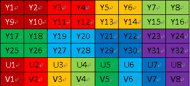
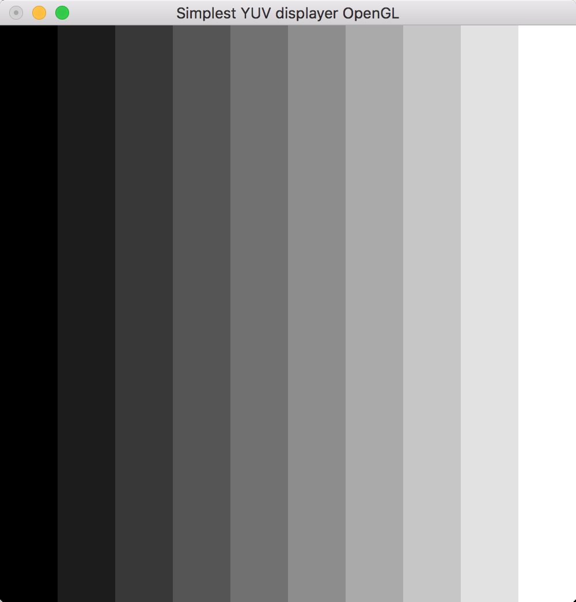

## 前言

对一种颜色进行编码的方法统称为"颜色空间"或"色域"，RGB和YUV，都是颜色空间的种类。iOS中获取到的摄像头的原始数据，常见也就是RGB和YUV。RGB可能大家都比较熟，就是每个像素由三原色分量组成，在计算机存储中三个分量的值在0~255之间。YUV也是有三个分量的，只是存储的信息与RGB是完全不一样的。

## YUV简介

YUV（亦称YCrCb）是被欧洲电视系统所采用的一种颜色编码方法（属于PAL）。YUV主要用于优化彩色视频信号的传输，使其向后兼容老式黑白电视。主要用于电视系统以及模拟视频领域，它将亮度信息（Y）与色彩信息（UV）分离，**没有UV信息一样可以显示完整的图像，只不过是黑白的**，这样的设计很好地解决了彩色电视机与黑白电视的兼容问题。与RGB视频信号传输相比，它最大的优点在于只需占用极少的带宽（RGB要求三个独立的视频信号同时传输）。

YUV格式有两大类：`planar`和`packed`。
- 对于planar的YUV格式，先连续存储所有像素点的Y，紧接着存储所有像素点的U，随后是所有像素点的V。
- 对于packed的YUV格式，每个像素点的Y,U,V是连续交*存储的。

YUV，分为三个分量，“Y”表示明亮度（Luminance或Luma），也就是灰度值；而“U”和“V” 表示的则是色度（Chrominance或Chroma），作用是描述影像色彩及饱和度，用于指定像素的颜色。YUV码流的存储格式其实与其采样的方式密切相关，主流的采样方式有三种，`YUV4:4:4`，`YUV4:2:2`，`YUV4:2:0`，如图1所示，以黑点表示采样该像素点的Y分量，以空心圆圈表示采用该像素点的UV分量。

<center>


图1、主流YUV采样图

</center>

按照图1所示，每种采样的区别在于YUV分量的比例，我们知道仅有Y分量就可以组成一幅完整的黑白画面，UV控制的是色彩和饱和度，降低UV的采样率并不会明显降低视觉质量，只是色度会减弱。

- YUV 4:4:4采样，每一个Y对应一组UV分量。
- YUV 4:2:2采样，每两个Y共用一组UV分量。 
- YUV 4:2:0采样，每四个Y共用一组UV分量。

## YUV420P结构分析

YUV420P结构比较简单，应用比较广泛。在YUV420P中，P代表`planar`，意味着像素点的YUV都是是分开存储的，还可以分为I420和YV12。I420格式和YV12格式的不同处在U平面和V平面的位置：

- I420: YYYYYYYY UU VV =>YUV420P
- YV12: YYYYYYYY VV UU =>YUV420P

<center>



图2、YUV420P I420结构图

</center>

在内存中是以`Y1 Y2 ... Y32 U1 U2 ... U8 V1 V2 ... V8`去存储的，所以必须要知道图片宽度才能正确解析出。图2中排法让我们更直观的看出分量间的关系，不同的色块对应着不同的组合关系，比如Y1、Y2、Y9、Y10对应的UV采集为U1、V1。

## YUV420P与RGB24的转化

显示设备都是RGB的三原色显示标准，想要在屏幕中显示YUV图像需要将其转为RGB图像，转换是通过公式计算的方式完成的，在网上搜索会出现很多公式，有些就差小数点几位，但是都能正常地转化。至于为什么这么多种，可以参考一下[《YUV与RGB互转各种公式 (YUV与RGB的转换公式有很多种，请注意区别！！！)》](https://www.cnblogs.com/luoyinjie/p/7219319.html)这篇文章，差小数点后几位的真的不知道哪里来的差别。。。

这里就用雷神程序里的计算公式吧：

YUV420P -> RGB24

```c
R = Y + ( 1.4075 * (V - 128) );  
G = Y - ( 0.3455 * (U - 128) - 0.7169 * (V - 128) );  
B = Y + ( 1.7790 * (U - 128) );  
```

RGB24 -> YUV420P

```c
Y= 0.299 * R + 0.587 * G + 0.114 * B
U= -0.147 * R - 0.289 * G + 0.463 * B
V= 0.615 * R - 0.515 * G - 0.100 * B
```

## YUV420P生成与显示

了解完YUV420P的存储方式以及转化显示原理，可以找一张图片过来试试，也可以自己手动生成一张图片，验证一下以上的理论。这里我直接拿雷神的生成YUV420P格式的灰阶测试图程序来验证。

```c
/** 
 * Generate YUV420P gray scale bar. 
 * @param width    Width of Output YUV file. 
 * @param height   Height of Output YUV file. 
 * @param ymin     Max value of Y 
 * @param ymax     Min value of Y 
 * @param barnum   Number of bars 
 * @param url_out  Location of Output YUV file. 
 */  
int simplest_yuv420_graybar(int width, int height,int ymin,int ymax,int barnum,char *url_out){  
    int barwidth;  
    float lum_inc;  
    unsigned char lum_temp;  
    int uv_width,uv_height;  
    FILE *fp=NULL;  
    unsigned char *data_y=NULL;  
    unsigned char *data_u=NULL;  
    unsigned char *data_v=NULL;  
    int t=0,i=0,j=0;  
  
    barwidth=width/barnum;  
    lum_inc=((float)(ymax-ymin))/((float)(barnum-1));  
    uv_width=width/2;  
    uv_height=height/2;  
  
    data_y=(unsigned char *)malloc(width*height);  
    data_u=(unsigned char *)malloc(uv_width*uv_height);  
    data_v=(unsigned char *)malloc(uv_width*uv_height);  
  
    if((fp=fopen(url_out,"wb+"))==NULL){  
        printf("Error: Cannot create file!");  
        return -1;  
    }  
  
    //Output Info 打印YUV分量 
    printf("Y, U, V value from picture's left to right:\n");  
    for(t=0;t<(width/barwidth);t++){  
        lum_temp=ymin+(char)(t*lum_inc);  
        printf("%3d, 128, 128\n",lum_temp);  
    }  
    //Gen Data 
    //存储Y分量
    for(j=0;j<height;j++){  
        for(i=0;i<width;i++){  
            t=i/barwidth;  
            lum_temp = ymin + (char)(t * lum_inc);  
            data_y[j*width+i]=lum_temp;  
        }  
    }  
    //存储U分量
    for(j=0;j<uv_height;j++){  
        for(i=0;i<uv_width;i++){  
            data_u[j*uv_width+i]=128;  
        }  
    }  
    //存储V分量
    for(j=0;j<uv_height;j++){  
        for(i=0;i<uv_width;i++){  
            data_v[j*uv_width+i]=128;  
        }  
    }  
    fwrite(data_y,width*height,1,fp);  
    fwrite(data_u,uv_width*uv_height,1,fp);  
    fwrite(data_v,uv_width*uv_height,1,fp);  
    fclose(fp);  
    free(data_y);  
    free(data_u);  
    free(data_v);  
    return 0;  
} 
```

调用如下，传入宽高、Y分量的取值范围以及灰度条的个数，这里传了10，最后一个参数是生成图片的存储路径。程序中我们看到，Y分量根据不同的灰度递增，U和V都为128，根据转换公式，在转为RGB时RGB分量都取值Y。也可以随意修改UV值看能得出一个什么样的图片，进一步地理解。关于YUV图像的更多处理请参考《[视音频数据处理入门：RGB、YUV像素数据处理](https://blog.csdn.net/leixiaohua1020/article/details/50534150)》。

```c
simplest_yuv420_graybar(640, 360, 0, 255, 10, "graybar_640x360.yuv");
```
显示也是参考雷神《[最简单的视音频播放示例5：OpenGL播放RGB/YUV](https://blog.csdn.net/leixiaohua1020/article/details/40333583)》，这里截出转化的代码，其余部分可以去雷神的博客看看，比较浅显易懂。

```c
inline unsigned char CONVERT_ADJUST(double tmp)  
{  
    return (unsigned char)((tmp >= 0 && tmp <= 255)?tmp:(tmp < 0 ? 0 : 255));  
}  
//YUV420P to RGB24  
void CONVERT_YUV420PtoRGB24(unsigned char* yuv_src,unsigned char* rgb_dst,int nWidth,int nHeight)  
{  
    unsigned char *tmpbuf=(unsigned char *)malloc(nWidth*nHeight*3);  
    unsigned char Y,U,V,R,G,B;  
    unsigned char* y_planar,*u_planar,*v_planar;  
    int rgb_width , u_width;  
    rgb_width = nWidth * 3;  
    u_width = (nWidth >> 1);  
    int ypSize = nWidth * nHeight;  
    int upSize = (ypSize>>2);  
    int offSet = 0;  
  
    y_planar = yuv_src;  
    u_planar = yuv_src + ypSize;  
    v_planar = u_planar + upSize;  
  
    for(int i = 0; i < nHeight; i++)  
    {  
        for(int j = 0; j < nWidth; j ++)  
        {  
            // Get the Y value from the y planar  
            Y = *(y_planar + nWidth * i + j);  
            // Get the V value from the u planar  
            offSet = (i>>1) * (u_width) + (j>>1);  
            V = *(u_planar + offSet);  
            // Get the U value from the v planar  
            U = *(v_planar + offSet);  
  
            // Cacular the R,G,B values  
            R = CONVERT_ADJUST((Y + (1.4075 * (V - 128))));  
            G = CONVERT_ADJUST((Y - (0.3455 * (U - 128) - 0.7169 * (V - 128))));  
            B = CONVERT_ADJUST((Y + (1.7790 * (U - 128))));  
            
            offSet = rgb_width * i + j * 3;  
  
            rgb_dst[offSet] = B;  
            rgb_dst[offSet + 1] = G;  
            rgb_dst[offSet + 2] = R;  
        }  
    }  
    free(tmpbuf);  
}  
```
<center>

</img>
图3、YUV灰阶测试图显示
</center>

## 后话

这里只是对YUV420P图像结构的基本了解，往后YUV图像采集和播放有一定的认识。终于也对大学时学的MATLAB函数有点了解，如果当初先了解这些，也许我会更有兴趣学习图像处理吧。

## 参考

《[最简单的视音频播放示例5：OpenGL播放RGB/YUV](https://blog.csdn.net/leixiaohua1020/article/details/40333583)》

《[视音频数据处理入门：RGB、YUV像素数据处理](https://blog.csdn.net/leixiaohua1020/article/details/50534150)》

《[图文详解YUV420数据格式](http://www.cnblogs.com/azraelly/archive/2013/01/01/2841269.html)》

《[从零开始学习音视频编程技术（十五） YUV420P转RGB32](http://blog.yundiantech.com/?log=blog&id=19)》

《[YUV与RGB互转各种公式 (YUV与RGB的转换公式有很多种，请注意区别！！！)](https://www.cnblogs.com/luoyinjie/p/7219319.html)》


