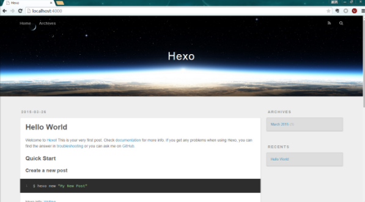

## Hexo + GitHub Pages 搭建个人博客

<!-- TOC -->

- [Hexo + GitHub Pages 搭建个人博客](#hexo--github-pages-搭建个人博客)
    - [1. 前言](#1-前言)
    - [2. 搭建步骤](#2-搭建步骤)
    - [3. 搭建 Node.js 环境](#3-搭建-nodejs-环境)
    - [4. 搭建Git环境 & GitHub注册和配置](#4-搭建git环境--github注册和配置)
    - [5. 安装配置 Hexo](#5-安装配置-hexo)
    - [6. 关联 Hexo 与 GitHub Pages](#6-关联-hexo-与-github-pages)
        - [6.1 生成SSH Keys](#61-生成ssh-keys)
        - [6.2 添加 SSH Key 到 GitHub](#62-添加-ssh-key-到-github)
        - [6.3 测试](#63-测试)
        - [6.4 配置信息](#64-配置信息)
    - [7. Hexo 的常用操作](#7-hexo-的常用操作)
    - [8. Hexo 主题](#8-hexo-主题)
    - [9. 后话](#9-后话)
    - [10. 参考](#10-参考)

<!-- /TOC -->

### 1. 前言

对于一个强迫症患者来说，搭建个人博客是一件让人抓狂的事情。四处寻找主题，有的是功能不全，没有分类和标签；有的是样式太随便，字体和布局都不大满意，对于一个不熟悉前端的人来说，修改样式有点费时间；还有就是环境问题，很多教程都是博客老手写出来的，有些细节点并没有很好的说明。仅以此文记录自己在 **macOS环境** 中安装的步骤和遇到的问题，如有其它问题欢迎交流。

### 2. 搭建步骤

这次介绍的是使用 Hexo + GitHub Pages 搭建个人博客。Hexo是基于Nodejs的框架，一个快速、简洁且高效的博客框架。Hexo 使用 Markdown（或其他渲染引擎）解析文章，在几秒内，即可利用靓丽的主题生成静态网页。再使用GitHub托管就能免费搭建个人博客。

    ```
    1. 搭建 Node.js 环境
    2. 搭建 Git 环境
    3. GitHub 注册和配置
    4. 安装配置 Hexo
    5. 关联 Hexo 与 GitHub Pages
    6. Hexo 的常用操作
    7. Hexo 主题
    ```

### 3. 搭建 Node.js 环境

前面说过Hexo是基于Nodejs的，所以必须要搭建Nodejs的环境，其中包括安装Nodejs编译环境和npm（JavaScript包管理工具）。搭建Nodejs环境的方法五花八门，不过可以大致分成几类：

a. 下载Nodejs安装包，直接安装；
- 英文地址[https://nodejs.org/en/](https://nodejs.org/en/)；
- 中文地址[http://nodejs.cn/download/](http://nodejs.cn/download/)。

b. 从克隆或者下载源码编译安装
- 使用命令`$ sudo git clone https://github.com/nodejs/node.git`将源码克隆到本地；
- 修改目录权限`$ sudo chmod -R 755 node`；
- 先后执行一下命令完成编译安装：

    ```
    $ cd node
    $ sudo ./configure
    $ sudo make
    $ sudo make install
    $ node --version
    ```

	
c. 利用包brew等管理工具安装，brew是macOS下的一个软件管理工具，因为网络长城和其他环境原因安装起来并不简单，可能需要换国内镜像，但是国内镜像也有出问题的时候，遇到问题还需要google

- 安装brew 

    ```
    /usr/bin/ruby -e "$(curl -fsSL https://raw.githubusercontent.com/Homebrew/install/master/install)"
    ```

- 安装node和npm `brew install node --with-npm`
- 查看安装是否成功

    ```
    $ node -v
    $ npm -v
    ```

### 4. 搭建Git环境 & GitHub注册和配置

&ensp;&ensp;在macOS里面安装了Xcode就会附带安装Git，同时还有下载安装包和管理工具两种方式，这里附带下载地址[http://git-scm.com/downloads](http://git-scm.com/downloads)，不做过多说明。

&ensp;&ensp;在GitHub（[https://github.com/](https://github.com/)）注册一个账号就不用过多说明。
&ensp;&ensp;配置就是要去建一个[GitHub Pages](https://pages.github.com/)的仓库，在GitHub Pages的主页是一句这样的介绍：Websites for you and your projects. 就是GitHub提供的一个存放静态网站的仓库，和普通仓库的区别就是它还能通过 https://username.github.io 域名来访问到这个网站。
并没什么具体的步骤，只需要新建一个repository名字为username.github.io。
    **username一定要是你的用户名！**
    **username一定要是你的用户名！**
    **username一定要是你的用户名！**


### 5. 安装配置 Hexo

> 官网就有安装步骤，有时间可以去看下[https://hexo.io/zh-cn/](https://hexo.io/zh-cn/)

1. 用npm安装hexo：`npm install hexo-cli -g`
2. 安装完成查看版本信息，验证是否安装成功：`hexo version`
3. 接下来就是配置你的个人博客

    ```
    # 在本地创建一个hexo项目存放在username.github.io，这个和之前创建的仓库名一致
    $ hexo init username.github.io
    # 进入文件夹
    $ cd username.github.io
    # 把需要的依赖环境都自动装上
    $ npm install
    # 安装部署模块，有了这个模块才能使用 hexo d 部署到仓库中去，后面会讲
    $ npm install hexo-deployer-git --save
    # 安装启动服务模块，有了它才能在本地运行，预览效果
    $ npm install hexo-server --save
    ```

4. 本地运行博客，预览效果

    ```
    $ hexo server
    或者
    $ hexo s
    ```

<center>

图1、博客的艰难部署过程/预览效果图
</center>

### 6. 关联 Hexo 与 GitHub Pages

经过上一章节的操作，已经能够在本地写文章并且预览，现在就是要关联之前创建的GitHub Pages仓库，这样我就可以通过username.github.io 域名去访问。

#### 6.1 生成SSH Keys

输入一下命令，自己的邮箱地址`"xxxxxxxxxx@mail.com"`，`ssh-keygen -t rsa`表示我们指定 RSA 算法生成密钥。

`$ ssh-keygen -t rsa -C "xxxxxxxxxx@mail.com"`

执行后会要求输入密码，密码的话需要6位数以上，没有什么具体要求，不输入则是不需要密码。之后就就会生成两个文件，分别为`id_rsa`和`id_rsa.pub`，即密钥`id_rsa`和公钥`id_rsa.pub`。

#### 6.2 添加 SSH Key 到 GitHub

<center>

图2、添加SSH Key
</center>

首先要在个人GitHub的`setting->SSH and GPG Keys`([https://github.com/settings/ssh](https://github.com/settings/ssh))中`New SSH Key`，在macOS中找到`~/.ssh/id_rsa.pub`，将`id_rsa.pub`中的内容复制到新建`SSH Key`的`Key`框中，点击`ADD SSH Key`即可。


#### 6.3 测试

执行以下命令查看是添加成功：

```
$ ssh -T git@github.com
```

第一次执行clone或者push会有如下警告：

```
The authenticity of host 'github.com (xx.xx.xx.xx)' can't be established.
RSA key fingerprint is xx.xx.xx.xx.xx.
Are you sure you want to continue connecting (yes/no)?
```

这是因为Git使用SSH连接，而SSH连接在第一次验证GitHub服务器的Key时，需要你确认GitHub的Key的指纹信息是否真的来自GitHub的服务器，输入yes回车即可，得到一下信息即已经添加成功。
	
```
Hi aierui! You've successfully authenticated, but GitHub does not provide shell access.
```

#### 6.4 配置信息

Git 会根据用户的名字和邮箱来记录提交。GitHub 也是用这些信息来做权限的处理，输入下面的代码进行个人信息的设置，把名称和邮箱替换成你自己的。

```
$ git config --global user.name "username"
$ git config --global user.email "xxxxx@mail.com"
```

在博客更目录`_config.yml`文件中，找到`Deployment`，然后按照如下修改，用户名改成你的：

需要注意的是冒号后面记得空一格！
	
```
# Deployment
## Docs: https://hexo.io/docs/deployment.html
deploy:
  type: git
  repo: git@github.com:username/username.github.io.git
  branch: master
```

### 7. Hexo 的常用操作

结束了上面的配置，就可以开始写文章、渲染、发布，涉及的操作有：

```
# 新建文章
$ hexo new "postName"

# 清除旧的发布文件
$ hexo clean

# 生成发布文件
$ hexo generate
或者
$ hexo g

# 本地预览
hexo s

# 发布
$ hexo deploye
或者
$ hexo d
```

如果发布成功，就可以用 username.github.io 访问到你的博客，如果有自己的域名也可以配置成你的域名来访问，具体参考中的《[可能是最详细的 Hexo + GitHub Pages 搭建博客的教程](http://www.lovebxm.com/2017/05/30/buildBlog/)》有介绍。如果遇到错误，不妨看下以下几个问题。

- 注意1：发布前要安装发布扩张

```
$ npm install hexo-deployer-git --save
```

- 注意2：如果在执行 `hexo d` 后,出现 `error deployer not found:github` 的错误（如下），则是因为没有设置好 `public key` 所致，重新详细设置即可。

```
Permission denied (publickey).
fatal: Could not read from remote repository.
Please make sure you have the correct access rights
and the repository exists.
```

- 注意3：怎么避免 .md 文件被解析？

Hexo原理就是hexo在执行hexo generate时会在本地先把博客生成的一套静态站点放到public文件夹中，在执行hexo deploy时将其复制到.deploy文件夹中。Github的版本库通常建议同时附上README.md说明文件，但是hexo默认情况下会把所有md文件解析成html文件，所以即使你在线生成了 README. md，它也会在你下一次部署时被删去。怎么解决呢？

在执行hexo deploy前把在本地写好的README.md文件复制到.deploy文件夹中，再去执行hexo deploy。

### 8. Hexo 主题

官方主题库：[https://hexo.io/themes/](https://hexo.io/themes/)

主题是五花八门的，真正合心意的可能没几个，需要自己慢慢寻找。

纠结了很久之后用了[https://github.com/shenliyang/hexo-theme-snippet](https://github.com/shenliyang/hexo-theme-snippet)这款。

```
# 克隆主题到博客目录的themes/snippet文件夹下
git clone git://github.com/shenliyang/hexo-theme-snippet.git themes/snippet

# 安装主题渲染依赖插件
npm install hexo-renderer-ejs --save
npm install hexo-renderer-less --save

# 本地搜索支持插件
npm i hexo-generator-json-content@2.2.0 -S
```

然后修改`_config.yml`中的`theme: snippet`，其他的配置可以看参考作者的GitHub，执行`$ hexo clean`、`$ hexo generate`、`$ hexo s`即可预览到修改主题后的效果，效果满意就可以进行发布。
如果修改了某一个配置不起作用，不妨查看下是不是需要什么插件支持，对应地去安装插件。

### 9. 后话

GitHub Pages默认支持Jekyll+GitHub Pages的搭建，介绍：[http://www.jekyll.com.cn/](http://www.jekyll.com.cn/)；搭建起来会更加简单些，折腾过才知道哪个更适合自己。


### 10. 参考
- 《[可能是最详细的 Hexo + GitHub Pages 搭建博客的教程](http://www.lovebxm.com/2017/05/30/buildBlog/)》
- 《[hexo 博客搭建](http://huluo666.cn/2016/02/01/hexo%E5%8D%9A%E5%AE%A2%E6%90%AD%E5%BB%BA/)》
- 《[hexo主题安装](http://huluo666.cn/2016/02/02/hexo%E4%B8%BB%E9%A2%98%E5%AE%89%E8%A3%85/)》